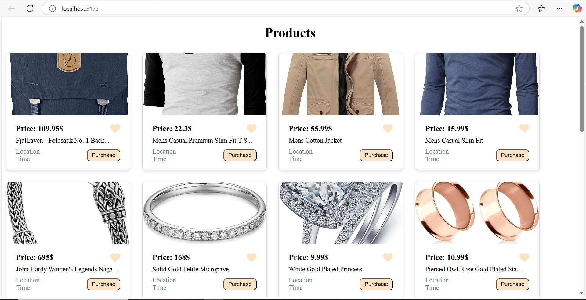

# 🛍️ 06-API-Products

A React-based product listing app that fetches data from a fake store API and displays product cards dynamically. Each card includes an image, title, price, and a purchase button styled using custom components and FontAwesome icons.

---

## 🚀 Features

- Fetches live product data from [FakeStoreAPI](https://fakestoreapi.com/)
- Dynamic product card rendering
- Custom reusable `Button` component
- FontAwesome heart icon for wishlisting
- Responsive and minimal UI
- Inline CSS styling for fast prototyping

---

## 🧱 Built With

- [React.js](https://reactjs.org/)
- [Vite](https://vitejs.dev/)
- [FontAwesome](https://fontawesome.com/)
- [FakeStoreAPI](https://fakestoreapi.com/)

---

## 📦 Installation

Clone the repo and install dependencies:

```bash
git clone https://github.com/asharaam1/06-API-Products.git
cd 06-API-Products
npm install
npm install @fortawesome/react-fontawesome
npm install @fortawesome/free-solid-svg-icons
```

Run the App
```bash
npm run dev
```
---

## 🔌 API Used
#### 📡 [FakeStoreAPI](https://fakestoreapi.com/)
Used for fetching realistic product data for testing & prototyping e-commerce UIs.

---

## 🖼️ UI Preview
 

 ---